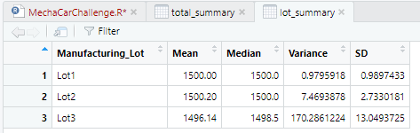
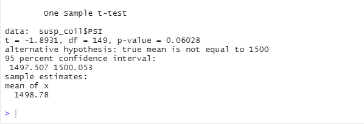
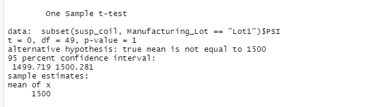
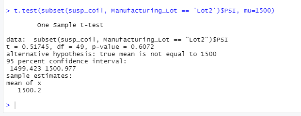
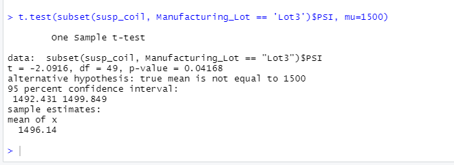

 
# MechaCar_Statistical_Analysis
## Linear Regression to Predict MPG
## Summary
###  Which variables/coefficients provided a non-random amount of variance to the mpg values in the dataset?

Vehicle Length and Ground Clearance (as well as Intercept) are statistically unlikely to provide random amounts of variance to the linear model. Vehicle Length having a p-value of 2.60e-12 and Ground Clearance having a p-value of 5.21e-08 both show to have statistical significance on MPG.

### Is the slope of the linear model considered to be zero? Why or why not?

The p-value from our model is below a significance level of 0.05% so we are able to reject the null hypothesis, identifying that the slope of this model is not zero.

### Does this linear model predict mpg of MechaCar prototypes effectively? Why or why not?

The R-squared value for this model is 0.715 which shows that 71% of the observed variations can be explained by this models inputs, proving to be a good model to predict MPG effectively.

 

## Summary Statistics on Suspension Coils
## Summary
The design specifications for the MechaCar suspension coils dictate that the variance of the suspension coils must not exceed 100 pounds per square inch. Does the current manufacturing data meet this design specification for all manufacturing lots in total and each lot individually? Why or why not?
The overall variance for all lots is 62.3 PSI, which meets design specifications. Summary of manufacturing lots show Lot 1 having a variance of 0.98 PSI and Lot 2 having a variance of 7.5 PSI; which are both below the design specification requirements. However, suspension coils from Lot 3 show a variance of 170.3 PSI, which is outside of the design specification requirements.

### Total Variance

 

### Lot Variance

 

## T-Tests on Suspension Coils
## Summary
* All Manufacturing Lot T Test

 

* P-Value for all lots is 0.06 which is above our significance level of 0.05; fail to reject null hypothesis.
### Lot 1 T Test

* P-Value for Lot 1 is 1 which is above our significance level of 0.05; fail to reject null hypothesis.
### Lot 2 T Test

* P-Value for Lot 2 is 0.06 which is above our significance level of 0.05; fail to reject null hypothesis.
### Lot 3 T Test

* P-Value for Lot 3 is 0.04 which is below our significance level of 0.05; reject null hypothesis.

# Study Design: MechaCar vs Competition
Statistical study on vehicle tailpipe emissions-MechaCar against competition

### What metric or metrics are you going to test?

* Metrics- vehicle emissions

### What is the null hypothesis or alternative hypothesis?

* Null Hypothesis- MechaCar produces equal or more emissions than it competition.
* Alternative Hypothesis- MechaCar produces less emissions than its competition.

### What statistical test would you use to test the hypothesis? And why?

* T Tests can be ran between MechaCar and individual competitors to show direct comparisons.
* ANOVA can be ran between MechaCar and multiple competitors to show overall comparisons.

### What data is needed to run the statistical test?

* Emissions from both MechaCar and its competitors.

